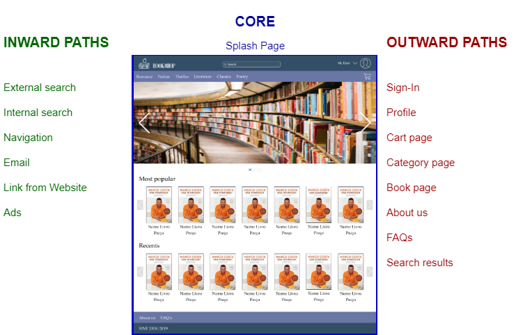

# Primavera API for the Online BookShop Web App

The API between Primavera and our Web app will be a REST API whose return values will be either HTTP codes or JSON strings.

## Splash Page

<table>
<tr>
  <th>Webservice ID</th><th>Webservice Description</th><th>Related Core View(s)</th><th>Input example</th><th>Expected Output</th>
</tr>
<tr>
  <td>WS01</td>
  <td>Creates a new user/client</td>
  <td>Splash Page</td>
  <td>
<pre>
{
    "Cliente": "1",
    "Nome": "Manfred Reubens",
    "Morada": "Praceta Conde Arnoso 60",
    "CodigoPostal": "2640-467",
    "Telefone": "6705966965",
    "NumContribuinte": "64287048860",
    "Pais": "PT",
    "Moeda": "EUR"
}
</pre>
  </td>
  <td>HTTP 204</td>
</tr>
<tr>
  <td>WS02</td>
  <td>Gets the relevant information of an user/client</td>
  <td>Profile Page</td>
  <td>
<pre>
Select Cliente, Nome, Fac_Mor, Fac_Local, Fac_Tel, NumContrib, CDU_email, CDU_password_hash from Clientes where Cliente = 'TIAGO'
</pre>
  </td>
  <td>
<pre>
{
    "DataSet": {
        "Table": [
            {
                "Cliente": "TIAGO",
                "Nome": "Tiago Santos",
                "Fac_Mor": "Rua Eng. Farinas de Almeida, 313, 4º esq",
                "Fac_Local": null,
                "Fac_Tel": "961843943",
                "NumContrib": "64287048860",
                "CDU_email": null,
                "CDU_password_hash": "03AC674216F3E15C761EE1A5E255F067953623C8B388B4459E13F978D7C846F4"
            }
        ]
    },
    "Query": "System.Data.SqlClient.SqlCommand"
}
</pre>
  </td>
</tr>
<tr>
  <td>WS03</td>
  <td>Updates the information of an user/client</td>
  <td>Profile Page</td>
  <td>
<pre>
"Select Cliente, Nome, Fac_Mor, Fac_Local, Fac_Tel, NumContrib from Clientes"
</pre>
  </td>
  <td>INCOMPLETE</td>
</tr>
<tr>
  <td>WS04</td>
  <td>Gets all the information of a book</td>
  <td>Book page</td>
  <td>
<pre>
"Select Descricao, CDU_descricao, CDU_ISBN, CDU_Editora, CDU_Idioma, CDU_Capa, CDU_Paginas, CDU_Ano, CDU_Dimensoes, CDU_Categoria from Artigo where Artigo = 'B0001'"
</pre>
  </td>
  <td>
<pre>
{
    "DataSet": {
        "Table": [
            {
                "Descricao": "Livro",
                "CDU_Titulo": "A Brief History Of Time",
                "CDU_Autor": "Stephen Hawking",
                "CDU_descricao": "Was there a beginning of time? Could time run backwards? Is the universe infinite or does it have boundaries? ",
                "CDU_ISBN": "0857501003",
                "CDU_Editora": "Transworld Publishers Ltd",
                "CDU_Idioma": "EN",
                "CDU_Capa": "Paperback",
                "CDU_Paginas": 272,
                "CDU_Ano": "05 Feb 2015",
                "CDU_Dimensoes": "127 x 198 x 17mm",
                "CDU_Categoria": "Science"
            }
        ]
    },
    "Query": "System.Data.SqlClient.SqlCommand"
}
</pre>
  </td>
</tr>
<tr>
  <td>WS05</td>
  <td>Gets a set of books that belong to the specified category</td>
  <td>Book page</td>
  <td>
<pre>
"Select Descricao, CDU_Titulo, CDU_Autor, CDU_descricao, CDU_ISBN, CDU_Editora, CDU_Idioma, CDU_Capa, CDU_Paginas, CDU_Ano, CDU_Dimensoes, CDU_Categoria from Artigo where CDU_Categoria = 'Romance'"
</pre>
  </td>
  <td>
<pre>
INCOMPLETE
</pre>
  </td>
</tr>
</table>

<!--template
<table>
<tr>
  <th>ID</th>
  <th>Method</th>
  <th>Route</th>
  <th>Description</th>
  <th>Body</th>
  <th>Return</th>
</tr>
<tr>
  <td></td>
  <td></td>
  <td></td>
  <td></td>
  <td></td>
  <td>
  </td>
</tr>
</table>
-->

<!--
## 1. API for user-related functionalities

This API deals with all the stuff regarding an user/client, such as their registration and profile information.

<table>
<tr>
  <th>ID</th>
  <th>Method</th>
  <th>Route</th>
  <th>Description</th>
  <th>Body</th>
  <th>Return</th>
</tr>
<tr>
  <td>101</td>
  <td>PUT</td>
  <td>/user/create</td>
  <td>Register a new user</td>
  <td>name, birthdate, address, postal_code, nif, phone, email, username, password</td>
  <td>Code 200 if OK, 500 otherwise</td>
</tr>
<tr>
  <td>102</td>
  <td>GET</td>
  <td>/user/{id}</td>
  <td>Get the profile of an user</td>
  <td>n/a</td>
  <td>
    <pre>
{
  name:string,
  birthdate:sting,
  address:string,
  postal_code:string,
  nif:int,
  phone:int,
  email:string,
  username:string
}
    </pre>
  </td>
</tr>
<tr>
  <td>103</td>
  <td>POST</td>
  <td>/user/{id}/edit</td>
  <td>Edit the password of an user</td>
  <td>password</td>
  <td>Code 200 if OK, 500 otherwise</td>
</tr>
</table>

## 2. API for book-related functionalities

This API deals with all functionalities related to books, such as getting the details of each one and getting lists of books by category or by search parameters.

<table>
<tr>
  <th>ID</th>
  <th>Method</th>
  <th>Route</th>
  <th>Description</th>
  <th>Body</th>
  <th>Returned JSON</th>
</tr>
<tr>
  <td>201</td>
  <td>GET</td>
  <td>/book/{id}</td>
  <td>Gets all info about a book</td>
  <td>n/a</td>
  <td>
    <pre>
{
  title:string,
  price:float,
  publisher:string,
  synopsis:string,
  image:string,
  isbn:int,
  pages:int,
  year:string,
  lang:string,
  dimensions:string,
  cover_type:string
}
    </pre>
  </td>
</tr>
<tr>
  <td>202</td>
  <td>GET</td>
  <td>/categories/{category}</td>
  <td>Gets all books from a given category</td>
  <td>n/a</td>
  <td>
    <pre>
{
  "books": [
    {id:int, title:string, price:float, cover:string},
    {id:int, title:string, price:float, cover:string},
    ...
    ]
}
</pre>
  </td>
</tr>
<tr>
  <td>203</td>
  <td>POST</td>
  <td>/search</td>
  <td>Get all books that match the specified parameters</td>
  <td>isbn, title, publisher</td>
  <td>
    <pre>
{
  "books": [
    {id:int, title:string, price:float, cover:string},
    {id:int, title:string, price:float, cover:string},
    ...
    ]
}
    </pre>
  </td>
</tr>
</table>

## 3. API for purchases

This API deals with the functionalities related to the purchasing process, allowing the addition or removal of items to the user's cart and to finalize a purchase.

<table>
<tr>
  <th>ID</th>
  <th>Method</th>
  <th>Route</th>
  <th>Description</th>
  <th>Body</th>
  <th>Return</th>
</tr>
<tr>
  <td>301</td>
  <td>PUT</td>
  <td>/user/{user_id}/cart/{book_id}</td>
  <td>Adds a book to the user's cart</td>
  <td>n/a</td>
  <td>Code 200 if OK, 500 otherwise</td>
</tr>
<tr>
  <td>302</td>
  <td>DELETE</td>
  <td>/user/{user_id}/cart/{book_id}</td>
  <td>Removes a book from the user's cart</td>
  <td>n/a</td>
  <td>Code 200 if OK, 500 otherwise</td>
</tr>
<tr>
  <td>303</td>
  <td>GET</td>
  <td>/user/{id}/cart</td>
  <td>Gets all the items on the user's cart</td>
  <td>n/a</td>
  <td>
    <pre>
{
   "books": [
  {id:int, title:string, price:float, cover:string},
  {id:int, title:string, price:float, cover:string},
  ...
  ]   
}
    </pre>
  </td>
</tr>
<tr>
  <td>304</td>
  <td>PUT</td>
  <td>/user/{id}/purchase</td>
  <td>Finalizes the purchase of the current books in the cart</td>
  <td>cc_number, cc_verification_code, cc_expiration, cc_owner</td>
  <td>Code 200 if OK, 500 otherwise</td>
</tr>
</table>

## 4. API for past sales information

This API allows for the listing of all orders made by an user and their current status.

<table>
<tr>
  <th>ID</th>
  <th>Method</th>
  <th>Route</th>
  <th>Description</th>
  <th>Body</th>
  <th>Return</th>
</tr>
<tr>
  <td>401</td>
  <td>GET</td>
  <td>/user/{id}/history</td>
  <td>Gets all the sales history of the user</td>
  <td>n/a</td>
  <td>
    <pre>
{
  orders: [
    {
      order_id:int,
      total_price:float,
      payment_method:string,
      date:string,
      status:string,
      items: [
        {book_id:int, cover:string},
        {book_id:int, cover:string},
        ...
      ]
    },
    ...
  ]
}
    </pre>
  </td>
</tr>
</table>
-->
